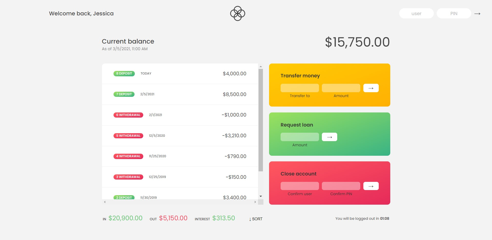

# Bankist App
> Bankist is one of the projects done as part of the  course - [The Complete JavaScript Course 2021: From Zero to Expert!](https://www.udemy.com/course/the-complete-javascript-course/)


In order to log in use the following credentials:

**Login**: *js / jd*

**PIN**: *1111 / 2222*

# Tools Used
*HTML5/CSS3, JS (DOM Manipulation)* 

### Feel free to clone and play around

```sh
git clone https://github.com/Maverick2502/bankist-app.git
```

# Screenshots



